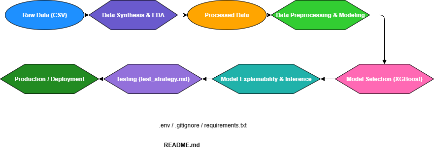

#  Insurance Risk Prediction using Machine Learning

This project demonstrates a full end-to-end machine learning pipeline to **predict the likelihood of a customer filing an insurance claim**. It covers data synthesis, preprocessing, modeling, hyperparameter tuning, threshold calibration to meet business goals, explainability using SHAP and model inference.

---


## Workflow


## Project Structure

```bash
insurance-risk-model/
├── data/                    # Raw & processed CSV files
│   ├── synth_insurance_data.csv
│   └── insurance_preprocessed.csv
├── models/                  # Trained model files (.pkl)
│   └── xgboost_tuned_model.pkl
├── notebooks/               # 3 key Jupyter notebooks
│   ├── Data Synthesis & Exploratory Data Analysis.ipynb
│   ├── Data Preprocessing & Modeling.ipynb
│   └── Model Explainability & Inference.ipynb
├── outputs/                 # Visualizations & exports
│   └── images/
├── tests/                   # Testing Strategy
│   └── test_strategy.md
├── requirements.txt         # Python packages
├── .gitignore
└── README.md
└── .env
└── productionising.md
```

---

## Workflow Overview

### 🔹 1. Data Synthesis & EDA
- Created a **synthetic dataset of 10,000 customers** with 40 realistic features.
- Target variable: `claim_status` (1 = customer filed a claim, 0 = no claim).
- Performed exploratory data analysis using histograms, pairplots, correlation heatmaps.

### 🔹 2. Preprocessing & Modeling
- Handled missing values, encoded categorical features, scaled numeric ones.
- Trained 4 models:
  - Logistic Regression
  - Decision Tree
  - XGBoost
  - LightGBM
- **Tuned top 2 models** using GridSearchCV.

### 🔹 3.Model Explainability & Inference
- Selected threshold to **ensure ≤ 5% of accepted customers file a claim**.
- Used **SHAP** to explain predictions and feature impact.
- Visualized:
  - SHAP summary plot
  - Waterfall plot for a single prediction
  - Feature importance
- Model Inference
---

## Results

| Metric                    | Value          |
|---------------------------|----------------|
| **Best Model**            | XGBoost (Tuned) |
| **ROC AUC**               | 0.6023         |
| **Final Threshold**       | 0.38           |
| **Claim Rate (accepted)** | ≤ 5%         |

---

## Key Features Driving Risk

- Credit Score
- Age
- Previous Claim History
- Health Status
- Driving Record

---

## How to Run

Install required packages:

```bash
pip install -r requirements.txt
```

Run the notebooks in order from the `notebooks/` directory:
1. `Data Synthesis & Exploratory Data Analysis.ipynb`
2. `Data Preprocessing & Modeling.ipynb`
3. `Modeling & Explainability.ipynb`

---

## Dependencies

- Python 3.10+
- scikit-learn
- xgboost
- lightgbm
- shap
- faker
- pandas, numpy, seaborn, matplotlib

---

## Future Steps

This project demonstrates a strong foundation for machine learning-based insurance risk prediction. To extend it into a robust production system, consider the following enhancements:

### 1. Create Model APIs
- Build RESTful endpoints using **FastAPI** or **Flask** to serve predictions.
- Include `/predict`, `/health`, and `/version` endpoints for usability and monitoring.
- Containerize the app using **Docker** for reproducibility.

### 2. Automate EDA and Reporting
- Automate Exploratory Data Analysis for incoming datasets using **Papermill** or **Jupyter Scheduler**.
- Generate automated visual reports (HTML/PDF) with libraries like **Sweetviz**, **Autoviz**, or **Great Expectations**.

### 3. Model Versioning & CI/CD
- Track model versions using **MLflow**, **DVC**, or **Weights & Biases**.
- Set up **CI/CD pipelines** with GitHub Actions for:
  - Unit testing
  - Model validation
  - Automated deployment triggers

### 4. Production Monitoring
- Monitor:
  - Model metrics (accuracy, AUC, drift)
  - Data pipeline health
- Use tools like **Prometheus**, **Grafana**, or **Evidently AI** for alerting and dashboards.

### 5. Logging & Observability
- Add structured logs using the `logging` module or **Loguru**.
- Log inputs, predictions, inference times, errors, and model versions for traceability.

### 6. Testing Strategy
- Implement:
  - **Unit tests** with `pytest` for each pipeline component
  - **Behavior-driven development (BDD)** for modeling workflows
  - **Test driven development (TDD)** for modeling workflows

### 7. Cloud & Deployment
- Deploy the model API on:
  - **AWS Lambda + API Gateway**
  - **Azure Functions**
- Store models/data in cloud buckets like **S3**, **Azure Blob**, or **GCS**.

---

These steps aim to move from a notebook-based prototype to a **production-grade, scalable, and observable ML pipeline**.
